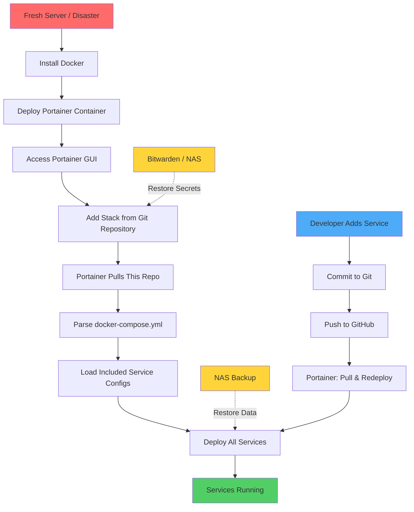

# Soteria Stack

Reproducible Docker infrastructure for the makerspace. All services are version-controlled and deployed via Portainer for easy disaster recovery.

## Architecture Overview



**Why this setup?**
- Volunteer-based environment needs reproducibility
- All configuration in Git = disaster recovery ready
- Portainer provides GUI for volunteers unfamiliar with CLI
- Data and secrets backed up separately
- Updates flow: Git → Portainer → Services

## Data Management

- **All data**: `/docker_data/` - Single directory containing all service data and Portainer configuration - Backed up to NAS
- **Secrets**: `./secrets/.env` - Excluded from Git, backed up to NAS + stored in Bitwarden
- **Configuration**: All `compose.yml` files - Version controlled in Git

This simple structure means **one rsync command backs up everything**.

## 🚨 PANIC: Disaster Recovery

### Complete System Rebuild

1. **Clone this repository**
   ```bash
   git clone <your-repo-url> soteria_compose
   cd soteria_compose
   ```

2. **Install Docker** (if not already installed)
   ```bash
   curl -fsSL https://get.docker.com | sh
   sudo usermod -aG docker $USER
   # Log out and back in for group changes to take effect
   ```

3. **Restore all data from NAS backup**
   ```bash
   # Restore all service data (including Portainer)
   rsync -avz nas:/backups/docker_data/ /docker_data/
   ```

4. **Restore secrets**
   ```bash
   mkdir -p ./secrets
   # Either restore from NAS or retrieve from Bitwarden
   rsync -avz nas:/backups/secrets/.env ./secrets/.env
   # Or retrieve from Bitwarden if not on NAS
   ```

5. **Deploy Portainer**
   ```bash
   cd infrastructure
   docker compose up -d
   ```

   Access Portainer at `http://<server-ip>:9000`

   - If you restored Portainer data: Your existing admin account, stacks, and settings will be there
   - If fresh install: Create admin account and proceed to step 6

6. **Deploy stack in Portainer** (only if fresh Portainer install)
   - Login to Portainer: `http://<server-ip>:9000`
   - Stacks → Add Stack → Repository
   - Git Repository URL: `https://github.com/<your-org>/soteria_compose`
   - Compose path: `docker-compose.yml`
   - Environment variables: Upload your `secrets/.env` file
   - Deploy!

7. **Verify services**
   ```bash
   docker ps
   docker compose logs -f
   ```

### Partial Service Recovery

If only one service is broken:

```bash
# Restart the service
docker compose restart <service-name>

# Rebuild and restart
docker compose up -d --force-recreate <service-name>

# Check logs
docker compose logs -f <service-name>
```

## Adding New Services

### Step 1: Create Service Directory

```bash
mkdir -p services/<service-name>
cd services/<service-name>
```

### Step 2: Create compose.yml

```yaml
services:
  myservice:
    image: <image-name>:<tag>
    environment:
      # Use secrets from .env
      KEY: ${VALUE}
    volumes:
      # Store data in /docker_data/
      - /docker_data/<service-name>:/app/data
    ports:
      - "<host-port>:<container-port>"
    restart: unless-stopped
```

### Step 3: Add to Root compose.yml

Edit `/docker-compose.yml`:

```yaml
include:
  - services/wikijs-wiki-prod-sot/compose.yml
  - services/<service-name>/compose.yml  # Add this line
```

### Step 4: Add Secrets (if needed)

Edit `./secrets/.env`:

```bash
# Service: <service-name>
VALUE=your_secret_value
```

### Step 5: Commit and Push

```bash
git add services/<service-name>/ docker-compose.yml
git commit -m "Add <service-name> service"
git push
```

### Step 6: Update Stack in Portainer

- Go to Portainer → Stacks → soteria_compose
- Click "Pull and redeploy"
- Or click "Editor" → "Update the stack"

## Common Operations

### View All Services

```bash
docker compose ps
```

### View Logs

```bash
# All services
docker compose logs -f

# Specific service
docker compose logs -f <service-name>
```

### Update a Service

```bash
# Pull latest image and recreate
docker compose pull <service-name>
docker compose up -d <service-name>
```

### Access Service Shell

```bash
docker compose exec <service-name> sh
```

### Backup Data

```bash
# Backup all service data (including Portainer) to NAS
rsync -avz /docker_data/ nas:/backups/docker_data/

# Backup secrets separately
rsync -avz ./secrets/.env nas:/backups/secrets/
```

**Note**: `/docker_data/` contains all service data including Portainer configuration, making backups simple and consistent.

## Current Services

### wikijs-wiki-prod-sot
- **Description**: Wiki.js with PostgreSQL
- **Access**: http://<server-ip>:3081
- **Data**: `/var/lib/docker/volumes/wikijs-wiki-prod-sot_wikidb-data/_data`
- **Secrets**: `POSTGRES_DB`, `POSTGRES_USER`, `POSTGRES_PASSWORD`

## Backup Schedule

**Automated** (setup required):
- Daily: `/docker_data/` → NAS
- Weekly: Verify backups
- Monthly: Test restore procedure

**Manual**:
- On changes: Update secrets in Bitwarden
- After adding services: Push to Git immediately

## Troubleshooting

### Service won't start

```bash
# Check logs
docker compose logs <service-name>

# Check if port is already in use
netstat -tlnp | grep <port>

# Verify secrets exist
ls -la ./secrets/.env
```

### Portainer can't pull from Git

- Check Git repository URL in Portainer
- Verify network connectivity
- Check if repository is public (or credentials configured)

### Data not persisting

- Verify volume paths in `compose.yml`
- Check permissions on `/docker_data/`
- Ensure volumes are correctly mounted: `docker inspect <container>`

## Security Notes

- Never commit `./secrets/.env` to Git
- Store sensitive data in Bitwarden
- Regular backup rotation on NAS
- Review service exposure (ports) regularly

## For More Details

See [CLAUDE.md](./CLAUDE.md) for detailed technical documentation and Docker Compose commands.
